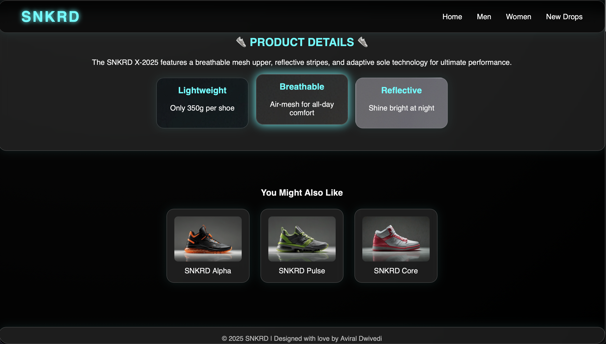

# 👟 SNKRD — Futuristic Sneaker Landing Page ⚡✨


> A bold, futuristic sneaker showcase — glowing visuals, clean layouts, and pure CSS magic. 🚀

---

## 🔥 Quick Preview

A **visually striking sneaker landing page** built using **only HTML and CSS**.
Designed with **neon glow effects, floating shoe visuals, and modern UI aesthetics**, SNKRD demonstrates how far strong frontend fundamentals can go **without JavaScript or frameworks**.

---

## 📸 Screenshots





---

## ⭐ Features

* ✨ Futuristic **neon & glow UI effects**
* 👟 Eye-catching **floating sneaker hero section**
* 🧭 Clean navigation bar with modern layout
* 📦 Product highlights and recommendation section
* 📱 Fully responsive for desktop and mobile screens
* 🎨 AI-generated sneaker images stored locally
* ⚡ Fast loading — no JS, no libraries, no frameworks

---

## 🧩 Tech Stack

* **Markup:** HTML5
* **Styles:** CSS3 (Flexbox, gradients, animations, transitions)
* **Behaviour:** None — pure static frontend ✨

> ❌ No JavaScript
> ❌ No external frameworks

---

## 🚀 Quick Start — Run Locally

1. Clone the repository

```bash
git clone https://github.com/your-username/snkrd.git
cd snkrd
```

2. Open `index.html` directly in your browser
   (No server required — works offline)

---

## 🔧 File Overview

```
/ (project root)
├─ index.html        # main landing page
├─ style.css         # all styling & glow effects
├─ images/           # AI-generated sneaker images
└─ README.md         # project documentation
```

All assets are linked using **relative paths**, making the project compatible with **GitHub Pages**.

---

## ✅ Design & Best Practices

* Clean and readable HTML structure
* Responsive layout using Flexbox
* Consistent color palette and glow effects
* Optimized assets for smooth performance
* Beginner-friendly and examiner-friendly codebase

---

## 🙌 Notes

This project is intentionally built using **only HTML and CSS** to demonstrate **strong frontend fundamentals, UI creativity, and layout skills** without relying on JavaScript.

---

## 📬 Author

* **Aviral Dwivedi**
  Frontend Developer 💻
